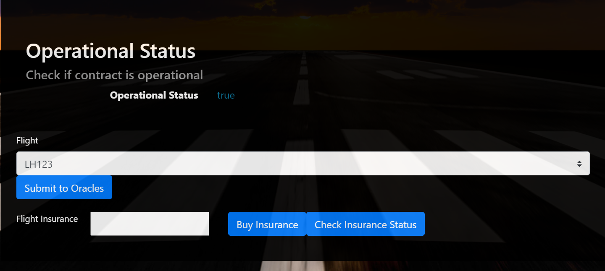
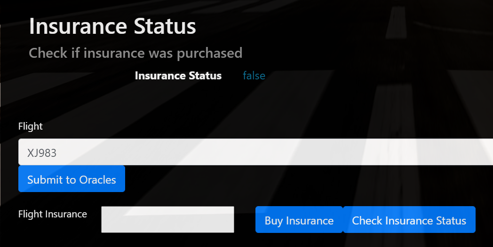
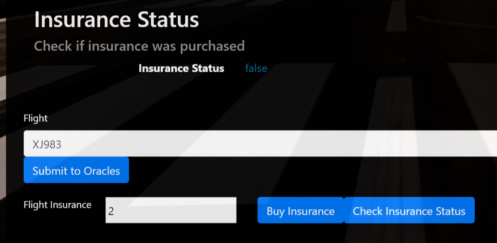
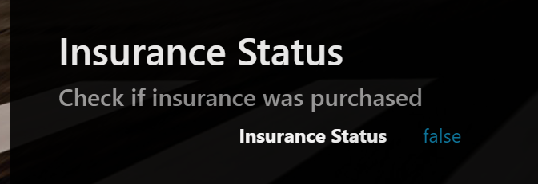
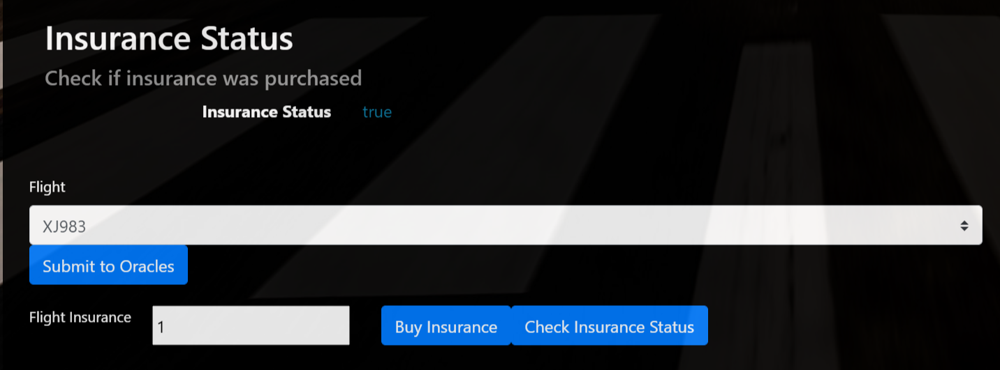
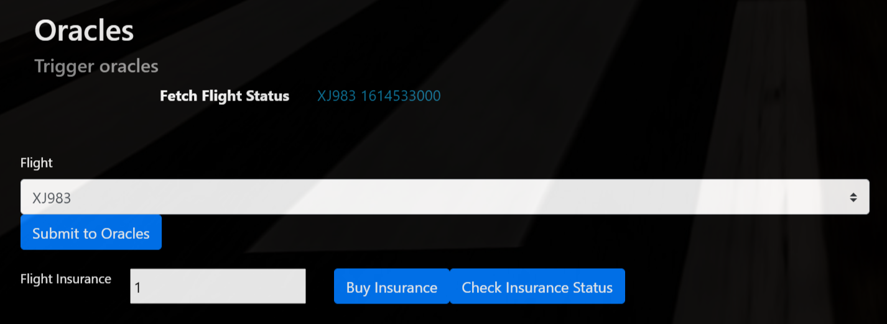

# Test Setup
All truffle-test(s) where run with the following ganache-cli configuration:
`ganache-cli -m "candy maple cake sugar pudding cream honey rich smooth crumble s weet treat" -d -g 1 -l 999999999999999 -a 50 -e 1000000`

# Testing the Dapp
If the smart contract is running correctly, you should see the following image stating that the Contract is _Operational_.

\
*For the next steps, please choose one of the defined flights and do not change it during the procedure.*
\
Next we want to ensure that there is no insurance present for a given flight. Please select one  of the flights in the
dropdown and click on the button *Check Insurance Status*. You should see an update in the Dapp, that indicates _false_.

\
If you want to test the 1 Ether limit, put 2 into the Flight Insurance text-input and click on *Buy Insurance*. This
method does not update the UI in the Dapp. Please click on *Check Insurance Status* next to validate, that the status
is still _false_.


\
Next please put 1 into the text-input and click on *Buy Insurance*. Next click on *Check Insurance Status* again. Now
the Insurance status should be _true_.

\
To trigger Oracle Events, please submit the flight to Oracles via *Submit to Oracles*. The Smart Contract will execute
the necessary actions in the background. As crediting of insurances is tested in Truffle tests, the Dapp has no further
capabilites.

\
Once the button was pressed, the Server console should show output comparable to the following:
```
{
  logIndex: 0,
  transactionIndex: 0,
  transactionHash: '0xc7922c1ee39db18cad05ed93a2ae19a4dcc61cdf2c3b3754e92c3efead6d6c01',
  blockHash: '0x590eeeaef443985de4fdd2e675d22ee5d557ea34196e67c5f005d1648e6e4a0b',
  blockNumber: 199,
  address: '0x075476F25Ef65d01A39b35edAc58610Bf573BA4d',
  type: 'mined',
  id: 'log_b0786a03',
  returnValues: Result {
    '0': '7',
    '1': '0x036EC7e0fbeD44D99d48f1C1587F7A558A64d9c7',
    '2': 'XJ983',
    '3': '1614533000',
    index: '7',
    airline: '0x036EC7e0fbeD44D99d48f1C1587F7A558A64d9c7',
    flight: 'XJ983',
    timestamp: '1614533000'
  },
  event: 'OracleRequest',
  signature: '0x3ed01f2c3fc24c6b329d931e35b03e390d23497d22b3f90e15b600343e93df11',
  raw: {
    data: '0x0000000000000000000000000000000000000000000000000000000000000007000000000000000000000000036ec7e0fbed44d99d48f1c1587f7a558a64d9c70000000000000000000000000000000
00000000000000000000000000000008000000000000000000000000000000000000000000000000000000000603bd1880000000000000000000000000000000000000000000000000000000000000005584a393833'
,
    topics: [
      '0x3ed01f2c3fc24c6b329d931e35b03e390d23497d22b3f90e15b600343e93df11'
    ]
  }
}
Oracle [ 23 ] has an active subscription for index { 7 } and returns StatusCode ( 10 ):
  .. calling submitOracleResponse(7,0x036EC7e0fbeD44D99d48f1C1587F7A558A64d9c7,XJ983,1614533000,10)
Oracle [ 27 ] has an active subscription for index { 7 } and returns StatusCode ( 30 ):
  .. calling submitOracleResponse(7,0x036EC7e0fbeD44D99d48f1C1587F7A558A64d9c7,XJ983,1614533000,30)
Oracle [ 28 ] has an active subscription for index { 7 } and returns StatusCode ( 50 ):
  .. calling submitOracleResponse(7,0x036EC7e0fbeD44D99d48f1C1587F7A558A64d9c7,XJ983,1614533000,50)
Oracle [ 29 ] has an active subscription for index { 7 } and returns StatusCode ( 10 ):
  .. calling submitOracleResponse(7,0x036EC7e0fbeD44D99d48f1C1587F7A558A64d9c7,XJ983,1614533000,10)
Oracle [ 33 ] has an active subscription for index { 7 } and returns StatusCode ( 0 ):
  .. calling submitOracleResponse(7,0x036EC7e0fbeD44D99d48f1C1587F7A558A64d9c7,XJ983,1614533000,0)
Oracle [ 36 ] has an active subscription for index { 7 } and returns StatusCode ( 20 ):
  .. calling submitOracleResponse(7,0x036EC7e0fbeD44D99d48f1C1587F7A558A64d9c7,XJ983,1614533000,20)
```
For simplicity, if one of the Oracles returns the Status Code 20, then the flight is considered late and the insuree
would gain credits for the purchased insurance in the smart contract. The credits can then be claimed. This is not 
implemented in the Dapp, but the functionality is tested in the Truffle tests.

# FlightSurety

FlightSurety is a sample application project for Udacity's Blockchain course.

## Install

This repository contains Smart Contract code in Solidity (using Truffle), tests (also using Truffle), dApp scaffolding
(using HTML, CSS and JS) and server app scaffolding.

To install, download or clone the repo, then:

`npm install`
`truffle compile`

## Develop Client

To run truffle tests:
`truffle test`

To run individual truffle tests:

`truffle test ./test/0-commons.js`\
`truffle test ./test/1-operating-status.js`\
`truffle test ./test/2-airline-registration.js`\
`truffle test ./test/3-voting.js`\
`truffle test ./test/4-flight-status-codes.js`\
`truffle test ./test/5-flight-insurance.js`\
`truffle test ./test/oracles.js`

To use the dapp:

`truffle migrate`
`npm run dapp`

To view dapp:

`http://localhost:8000`

## Develop Server

`npm run server`
`truffle test ./test/oracles.js`

## Deploy

To build dapp for prod:
`npm run dapp:prod`

Deploy the contents of the ./dapp folder


## Resources

* [How does Ethereum work anyway?](https://medium.com/@preethikasireddy/how-does-ethereum-work-anyway-22d1df506369)
* [BIP39 Mnemonic Generator](https://iancoleman.io/bip39/)
* [Truffle Framework](http://truffleframework.com/)
* [Ganache Local Blockchain](http://truffleframework.com/ganache/)
* [Remix Solidity IDE](https://remix.ethereum.org/)
* [Solidity Language Reference](http://solidity.readthedocs.io/en/v0.4.24/)
* [Ethereum Blockchain Explorer](https://etherscan.io/)
* [Web3Js Reference](https://github.com/ethereum/wiki/wiki/JavaScript-API)


# Project Rubrics
* Separation of Concerns, Operational Control and "Fail Fast".
    + **Smart Contract Separation**
        + Smart Contract Code is separated into multiple contracts.
            1) FlightSuretyData.sol for data persistance.
            2) FlightSuretyApp.sol for app logic and oracles code.
    + **Dapp Created and Used for Contract Calls**
        + A Dapp client has been created and is used for triggering contract calls. Client can be launched with "npm run
          dapp" and is available at http://localhost:8000.
            1) Passenger can purchase insurance for flight.
            2) Trigger contract to request flight status update.
    + **Oracle Server Application**
        + A server app has been crated for simulating oracle behavior. Server can be launched with "npm run server"
    + **Operational status control is implemented in contracts**
        + Student has implemented operational status control.
    + **Fail Fast Contract**
        + Contract functions "fail fast" by having a majority of "require()" calls at the beginning of function body.
* Airlines
    + **Airline Contract Initalization**
        + First airline is registered when contract is deployed.
    + **Multiparty Consensus**
        + Only existing airline may register a new airline until there are at least four airlines registered.
          Demonstrated either with Truffle test or by making call from client.
        + Registration of fifth and subsequent airlines requires multi-party consensus of 50% of registered airlines.
          Demonstrated either with Truffle test or by making call from the client.
    * **Airline Ante**
        + Airline can be registered, but does not participate in contract until it submits funding of 10 ether.
          Demonstrated either with Truffle test or by making call from client Dapp.
* Passengers
    + **Passenger Airline Choice**
        + Passengers can choose from a fixed list of flight numbers and departure that are defined in the Dapp client.
    + **Passenger Payment**
        + Passengers may pay up to 1 ether for purchasing flight insurance.
    + **Passenger Repayment*
        + If flight is delayed due to airline fault, passenger receives credit of 1.5X the amount they paid.
    + **Passenger Withdraw**
        + Passenger can withdraw any funds owed to them as a result of receiving credit for insurance payout.
    + **Insurance Payouts**
        + Insurance payouts are not sent directly to passenger's wallet.
* Oracles (Server App)
    + **Functioning Oracle**
        + Oracle functionality is implemented in the server app.
    + **Oracle Initialization**
        + Upon startup, 20+ oracles are registered and their assigned indexes are persisted in memory
    + **Oracle Updates**
        + Update flight status requests from client Dapp result in OracleRequest event emitted by Smart Contract that is
          captured by the server (displays on console and handled in code).
    + **Oracle Functionality**
        + Server will loop through all registered oracles, identify whose oracles for which the OracleRequest event
          applies, and respond by calling into FlightSuretyApp contract with random status code of:
          Unknown (0), On Time (10) or Late Airline (20), Late Weather (30), Late Technical (40), or Late Other(50).
